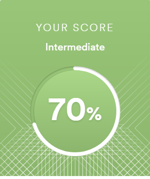
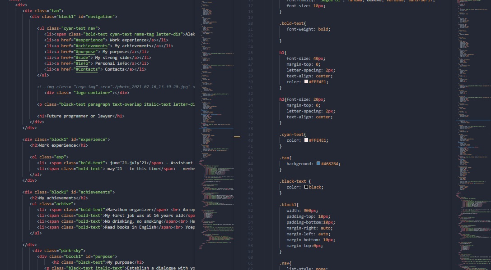

__Aleksandra Vlasiuk__
==================
*__Junior Frontend Developer__*
-------------------------
### _Contacts_
- Phone: +380663723156
- E-mail: vlasukoleksandra3@gmail.com
- Telegram: @vlasiuksasha
- [Linkedin](https://www.linkedin.com/in/%D0%BE%D0%BB%D0%B5%D0%BA%D1%81%D0%B0%D0%BD%D0%B4%D1%80%D0%B0-%D0%B2%D0%BB%D0%B0%D1%81%D1%8E%D0%BA-02a2ba215/)
- [Facebook](https://www.facebook.com/sashavlasuk6f/)

### _Briefly About Myself_
In 2018, I entered the _National University by Karazin_. It was a dream to study law.
But after a few years I realized that it was not mine. The lawyer's work turned out to be boring and uninteresting.
I started looking for something new for myself. In the summer of 2021, I accidentally found a webinar on website development. The webinar itself was short, but I learned the basics _HTML, CSS, JavaScript, PHP_.

After that, I started looking for new courses to gain additional knowledge while studying at university.
So I got acquainted with the following courses: _MateAcademy, HtmlAcademy, Hexlet_.
This is not the end of my studies, I try to improve my knowledge even more every day.
The only thing that struck me at the beginning was that I have no technical education, but now it is not a problem for me.

__I think that I am a very motivated and enduring person, because every day I get closer to my goal - to find a dream job so that it brings pleasure__.

### _Courses_: 
-	ITEA Education Academy on 21 Jul 2021.
-	Free courses from Hexlet and HTML Academy.

### _Skills:_
-	HTML, CSS
-	JavaScript Basics
-	Git, Github
-	PHP Basic
-	VS Code, Sublime Text
-	Adobe Photoshop, Illustrator.

### _Languages:_
-	__English__ – Intermediate;
  
-	__Ukraine__ – native;
-	__Russian__ – Intermediate;
-	__France__ – basic.

### _Code example:_
  

